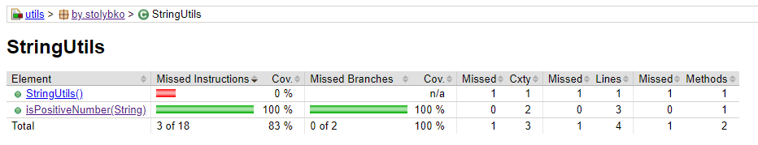

# gradle-trainer

тренировочный проект для изучения gradle

Используемый стек
---
1. Java 17
2. Gradle

Порядок выполнения задания:
---
1. Создал модуль utils с классом StringUtils с методом boolean isPositiveNumber(String str). Покрыл метод тестами.
   
2. Создал двa модуля: core и api.
3. Настроил зависимости в модулях.
4. В модуле core в классе Utils реализован метод boolean isAllPositiveNumbers(String… str), который использует метод boolean isPositiveNumber(String str) из utils-1.1.3.jar
5. Написал пару тестов на метод boolean isAllPositiveNumbers(String… str)
6. В модуле api создал класс App с методом main в котором вызывается метод isAllPositiveNumbers(String… str)

Для запуска метода main из класса App нужно предварительно выполнить таску build в модуле utils
